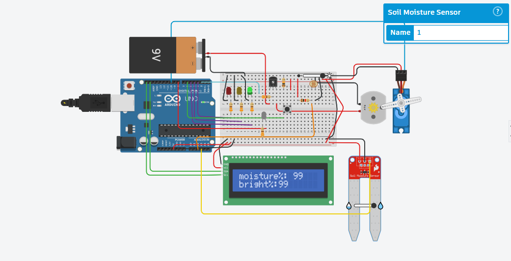

# 🌱 Simple Smart Irrigation System — Arduino Uno Based

An automatic plant irrigation system that monitors **soil moisture** and **ambient light**, waters the plant automatically when soil is dry, and allows manual watering via a push button. All readings are displayed live on an LCD screen.

---

## 📷 Circuit Diagram

---

## ⚙️ How It Works

The system reads soil moisture and light levels every 500ms and reacts accordingly:

### 💧 Moisture Control (Automatic)
| Moisture Level | LED Indicator | Action |
|---|---|---|
| ≥ 70% | 🟢 Green | Soil is wet — no action needed |
| 30% – 70% | 🟡 Yellow | Soil is medium — monitoring |
| < 30% | 🔴 Red | Soil is dry — auto watering starts |

When moisture drops below 30%, the servo valve opens and the pump turns ON. The system keeps watering until moisture reaches 90%, then shuts everything off automatically.

### 💡 Light Control (Automatic)
- If brightness ≥ 40% → LED light turns ON (shown as "LEDON" on LCD)
- If brightness < 40% → LED light turns OFF

### 🔘 Manual Watering (Button)
- Hold the push button to manually activate the pump and open the valve
- Live moisture percentage is shown on the LCD while pressing
- Releasing the button stops the pump and closes the valve

### 🖥️ LCD Display
The 16x2 LCD shows:
- **Row 1:** `moisture%: [value]`
- **Row 2:** `bright%: [value]` + LED status

On startup it displays: `"System ON"` → `"Initializing"` → `"Reading data"`

---

## 🧰 Components Used

| Component | Quantity |
|---|---|
| Arduino Uno | 1 |
| Soil Moisture Sensor | 1 |
| LDR (Light Sensor) | 1 |
| Servo Motor (valve) | 1 |
| DC Water Pump + Motor | 1 |
| 16x2 LCD Display (I2C) | 1 |
| Push Button | 1 |
| LED — Green | 1 |
| LED — Yellow | 1 |
| LED — Red | 1 |
| LED — Brightness indicator | 1 |
| 9V Battery | 1 |
| Breadboard + Jumper Wires | — |

---

## 📌 Pin Configuration

| Pin | Component |
|---|---|
| A3 | Soil Moisture Sensor |
| A2 | LDR Light Sensor |
| 2 | Water Pump (Motor) |
| 10 | Servo Motor (Valve) |
| 3 | Red LED |
| 4 | Yellow LED |
| 5 | Green LED |
| 6 | Push Button |
| 7 | Push Button (secondary) |
| 8 | Brightness LED |

---

## 📚 Libraries Required

Install these in the Arduino IDE before uploading:
- [`Adafruit_LiquidCrystal`](https://github.com/adafruit/Adafruit_LiquidCrystal)
- `Servo` (built-in with Arduino IDE)

---

## 🚀 How to Upload & Run

1. Install the required libraries in Arduino IDE
2. Open `irrigation_system.ino`
3. Connect your Arduino Uno via USB
4. Select the correct **Board** and **Port** in Arduino IDE
5. Click **Upload**
6. Power the circuit with the 9V battery
7. The LCD will show the boot sequence and start reading sensor data

---

## 🔗 Simulation
Try the live circuit simulation on Tinkercad:
[👉 View on Tinkercad](https://www.tinkercad.com/things/f1uDb44KsXE-plants-caring-system-)

## 👨‍💻 Author

**Ali Mousa** — Mechatronics Engineering Student @ Lebanese American University
